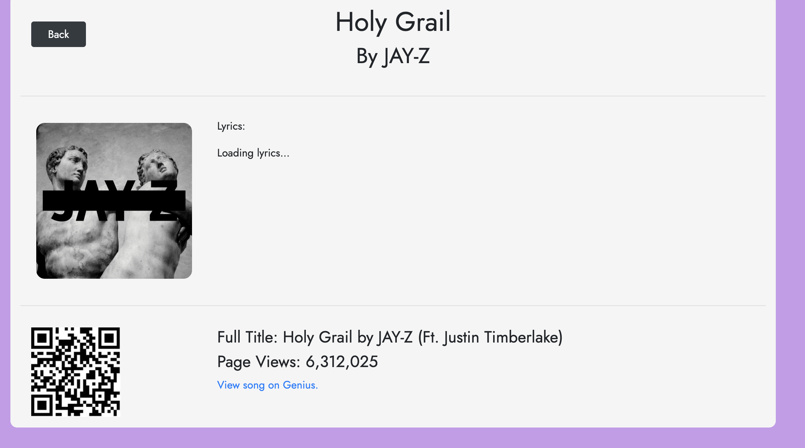

This is the first project in the Uconn Coding Bootcamp

Github Link: https://github.com/hbhoward/Interactive-Front-End-Project/
Deployed App: https://hbhoward.github.io/Interactive-Front-End-Project/

I was tasked with creating a static website that followed the following criteria:

Use a CSS framework other than Bootstrap.

Be deployed to GitHub Pages.

Be interactive (i.e: accept and respond to user input).

Use at least two server-side APIs.

Use client-side storage to store persistent data.

Be responsive.

Have a polished UI.

